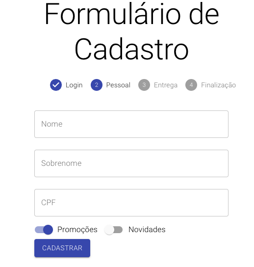

    
# Registration Form Page
 

### First Page Login

 

 

### Second Page Personal Information

 

### Last Page Delivery Information

     
     
# Technologies 

* JAVASCRIPT
* REACT JS

## Thanks for viewing my project.

Don't forget to follow me on Linkedin https://www.linkedin.com/in/rafael1807/

     
     
     
     
